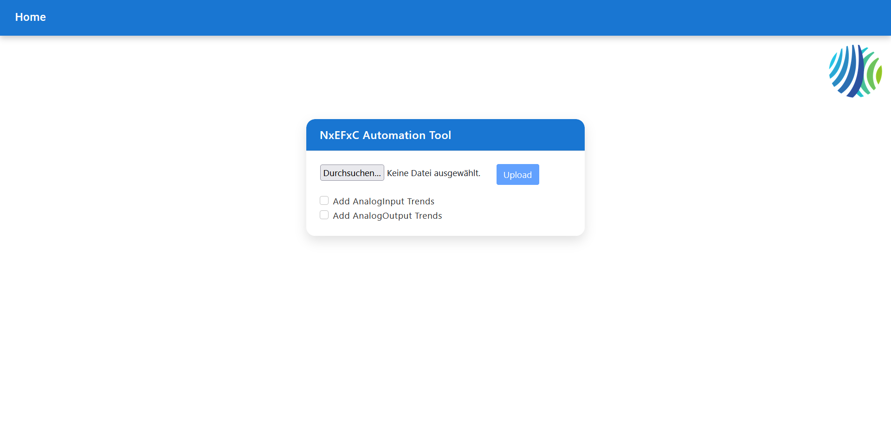
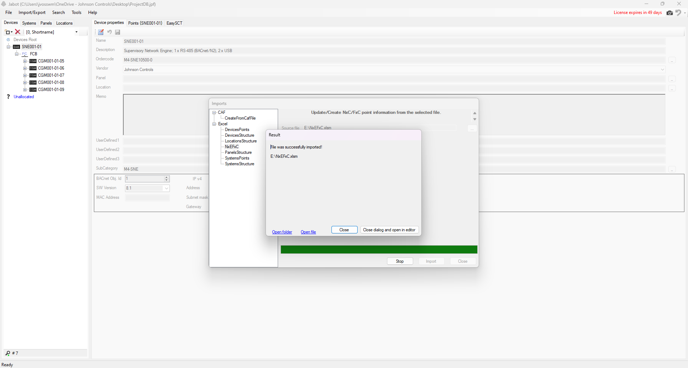

# NxEFxC-Automation-Tool

## Description
The **NxEFxC-Automation-Tool** is a Java application that automates the fill in for the NxEFxC.xlsm Excel File

---

## The Issue
To generate a **.caf** file **(Controller Application File)**, datapoint values must be set in the NxEFxC.xlsm file exported from Jabot.  
The NxEFxC.xlsm file contains ~260 columns; each column represents a different datapoint attribute such as:

- Unit
- Low Limit
- High Limit
- Signal
- Polarity
- Default Value

Filling every cell manually can take hours per system. If you are not experienced with the Metasys environment, the file can be overwhelming. Incorrect values also commonly cause import errors when re-importing the Excel file into Jabot.

*Example: Screenshot of an unprocessed Excel file*  
.png)
.png)

---

## The Solution
The **NxeFxC-Automation-Tool** automates the fill in for the NxEFxC.xlsm file. It selects sensible defaults based on datapoint types and only fills the required fields.

Key features:
- Algorithmically analyzes the NxEFxC.xlsm **raw** file  
- Sets the correct values for each datapoint type
- Is also able to generate trend data for Analog Inputs and Analog Outputs  
- Generates a file ready for re-import into Jabot
  
In a large project with over 1,000 data points, this tool saves several hours of manual work.

*Example: Screenshot of the processed Excel file*  
.png)
.png)
*Example: Screenshot of the successful import back to Jabot*  

After the successful import back to Jabot every datapoint will have the correct values set, the **Controller Application Files** can be generated and the programming of the PLC´s can be started!

---

## Tools & Technologies
The project uses the following technologies and libraries:

- **Java 21 with Spring Boot** — application backend  
- **Apache POI** — reading and writing Excel files  
- **Angular / TypeScript** — user interface  
- **Maven** — build and dependency management  
- **ChatGPT** — used for CSS styling assistance

---

## Privacy / Notes
**For privacy and data protection reasons, some details in the screenshots cannot be shown.  
If you have any questions regarding the data or the workflow, feel free to contact me.**

